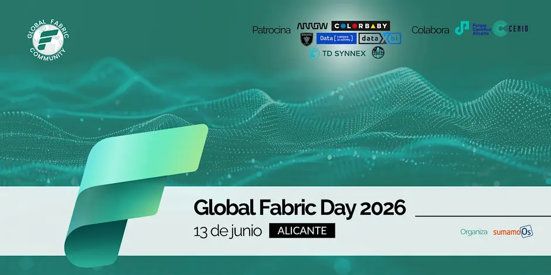

# Fabric sin dramas: Cómo dejar de rezar cada vez que subes a Producción — Global Fabric Day 2026 (Alicante)



Repositorio de la charla **"Fabric sin dramas: Cómo dejar de rezar cada vez que subes a Producción"** presentada en el Global Fabric Day 2026 (Alicante). Contiene la guía completa para replicar la demo paso a paso, el script de despliegue, los pipelines de Azure DevOps y las definiciones de los ítems del workspace de Fabric.

## El flujo que vas a montar

```
feature/* (branch-out desde Fabric)
    │  PR a dev
    ▼
dev ──Git integration──▶ Workspace GFD_DEV
    │
    │  PR de dev a pro ──▶ merge dispara el pipeline CD
    ▼
pro ──▶ fabric-cicd ──▶ Workspace GFD_PRO  (con aprobación manual)
```

## La guía

| # | Módulo | Qué haces |
| --- | --- | --- |
| 01 | [Prerrequisitos](docs/01-prerrequisitos.md) | Cuentas, capacidad, permisos |
| 02 | [Workspaces](docs/02-workspaces.md) | Crear Dev y Prod |
| 03 | [Contenido de la demo](docs/03-contenido-demo.md) | Lakehouse, Variable Library, notebook, pipeline, modelo, informe |
| 04 | [Git integration](docs/04-git-integration.md) | Conectar Dev a ADO, branch-out |
| 05 | [Service principal](docs/05-service-principal.md) | Identidad del pipeline (2 variantes) |
| 06 | [fabric-cicd](docs/06-fabric-cicd.md) | deploy.py, parameter.yml, prueba local |
| 07 | [Pipelines de ADO](docs/07-pipelines-ado.md) | CI + CD con aprobación |
| 08 | [Flujo completo](docs/08-flujo-completo.md) | El guion de la demo end-to-end |

## Qué hay en el repo

| Carpeta | Contenido |
| --- | --- |
| `src/fabric/` | Definiciones de los ítems de Fabric en formato Git más `parameter.yml` — ver detalle abajo |
| `src/deploy/` | Scripts Python de despliegue para los tres caminos (deploy total, por cambios, selectivo) |
| `src/pipelines/` | YAMLs de Azure Pipelines para los tres caminos de despliegue a pro |
| `docs/` | La guía de ocho módulos que cubre toda la configuración de extremo a extremo |
| `assets/` | Capturas de pantalla y recursos gráficos de la guía |
| `devtools/` | Utilitarios de depuración local (`debug_local.py`, `debug_parameterization.py`) |

> `src/` replica la estructura del repositorio de Azure DevOps de la demo; su contenido se copia en la raíz del repo ADO.

### Ítems de Fabric (`src/fabric/`)

| Carpeta | Tipo | Descripción |
| --- | --- | --- |
| `VL_GlobalFabricDay.VariableLibrary` | Variable Library | Variables `LAKEHOUSE_ID`, `WORKSPACE_ID`, `LAKEHOUSE_NAME`, `FABRIC_ENV`; value set `pro` |
| `LH_GlobalFabricDay.Lakehouse` | Lakehouse | Vacío; los notebooks crean las tablas en tiempo de ejecución |
| `NB_SetDefaultLakehouse.Notebook` | Notebook | Utilitario: vincula el lakehouse en runtime leyendo la Variable Library |
| `NB_LoadTalks.Notebook` | Notebook | Camino 1 (runtime): usa `%run NB_SetDefaultLakehouse`, sin GUIDs hardcodeados |
| `NB_ProcessTalks.Notebook` | Notebook | Camino 1 (runtime): usa `%run NB_SetDefaultLakehouse`, sin GUIDs hardcodeados |
| `NB_LoadTalks_Pipeline.Notebook` | Notebook | Camino 2 (pipeline): lakehouse vinculado + parámetros recibidos desde `PL_Orquestador` |
| `NB_ProcessTalks_Pipeline.Notebook` | Notebook | Camino 2 (pipeline): lakehouse vinculado + parámetros recibidos desde `PL_Orquestador` |
| `NB_Orquestador.Notebook` | Notebook | Orquestador alternativo: llama a los notebooks del camino 1 desde código |
| `PL_Orquestador.DataPipeline` | Data Pipeline | Orquesta los notebooks del camino 2 pasando variables desde la Variable Library |
| `SM_GlobalFabricDay.SemanticModel` | Modelo semántico | Exportado desde Fabric (formato TMDL) |
| `RPT_GlobalFabricDay.Report` | Informe Power BI | Exportado desde Fabric (formato PBIR) |

### Scripts de despliegue (`src/deploy/`)

| Script | Cuándo usarlo |
| --- | --- |
| `deploy-to-fabric.py` | **Camino 1** — despliega todos los ítems al workspace destino (pipeline CD por defecto) |
| `deploy-to-fabric-changes.py` | **Camino 2** — despliega solo los ítems modificados desde el commit anterior (git diff) |
| `deploy-to-fabric-selective.py` | **Camino 3** — despliega los ítems que se indican explícitamente (ejecución manual) |

### Pipelines de Azure Pipelines (`src/pipelines/`)

| Fichero | Camino |
| --- | --- |
| `deploy-to-fabric.yml` | Camino 1 — trigger en `pro`, deploy total |
| `deploy-to-fabric-changes.yml` | Camino 2 — trigger en `pro`, solo ítems cambiados |
| `deploy-to-fabric-selected-items.yml` | Camino 3 — sin trigger, ejecución manual con lista de ítems |

## ¿Cuánto cuesta replicarlo?

Nada. Puedes montar toda la demo con el trial de Microsoft Fabric (60 días) y el tier gratuito de Azure DevOps.

## Recursos

- [Documentación de fabric-cicd](https://microsoft.github.io/fabric-cicd/)
- [fabric-cicd en PyPI](https://pypi.org/project/fabric-cicd/)
- [Tutorial oficial de CI/CD con ADO y fabric-cicd — Microsoft Learn](https://learn.microsoft.com/fabric/cicd/tutorial-fabric-cicd-azure-devops)
- [Variable libraries en Microsoft Fabric](https://learn.microsoft.com/fabric/cicd/variable-library/variable-library-overview)
