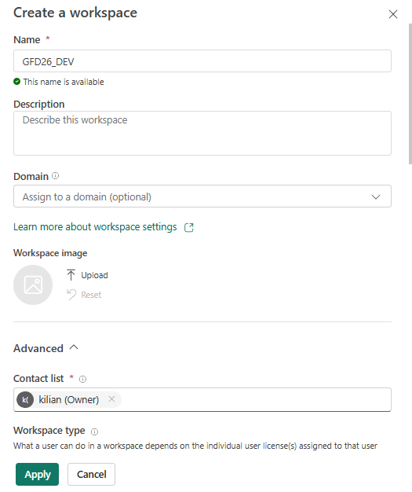

# Módulo 02 — Crear los workspaces

En esta demo usas dos workspaces con roles bien diferenciados: **GFD_DEV** es el entorno de desarrollo, conectado a la rama `dev` del repositorio **Global Fabric Day** de Azure Repos; **GFD_PRO** es el entorno de producción, que no se conecta a Git directamente sino que recibe los despliegues automatizados desde el pipeline de ADO. Ningún desarrollador publica en Prod a mano.

## Crear "GFD_DEV" y "GFD_PRO"

Para crear cada workspace ve a la barra lateral izquierda de Fabric, despliega **Workspaces** y haz clic en **+ New workspace**. Dale el nombre exacto (respetando mayúsculas y el guion), y en la sección **Advanced** asigna la capacidad trial que activaste en el módulo anterior; sin capacidad asignada los ítems de Fabric no se pueden crear. Repite el proceso para el segundo workspace.

## Convención de nombres

Usar un prefijo común como `GFD` hace que ambos workspaces aparezcan uno junto al otro al buscar en Fabric, lo que facilita la navegación durante la demo. Ten en cuenta que el **nombre del workspace no viaja en los despliegues**: fabric-cicd identifica cada workspace por su GUID, no por su nombre de pantalla, así que puedes renombrarlo sin romper el pipeline.

## Apunta los GUIDs

El GUID de un workspace aparece en la URL cuando lo abres: `app.fabric.microsoft.com/groups/<GUID>/...`. Copia ese identificador para cada workspace y guárdalo; lo necesitarás al configurar el archivo `parameter.yml` y las variables del pipeline en módulos posteriores.

| Workspace | GUID |
| --- | --- |
| GFD_DEV | 6b2d8c5d-8eb6-4b89-8f9e-5cfc82bdf2bb |
| GFD_PRO | 29679fba-5e38-4a04-8b1b-24342ab63c8f |

## ✅ Checkpoint

- [ ] Ambos workspaces existen y tienen capacidad asignada (icono de diamante/trial)
- [ ] Tienes los dos GUIDs apuntados

## Errores típicos

| Síntoma | Causa | Solución |
| --- | --- | --- |
| No se puede crear un notebook o lakehouse en el workspace | El workspace no tiene capacidad asignada | Edita el workspace (`Settings > Workspace Type`) y asigna la capacidad trial |

⬅️ [Módulo 01](01-prerrequisitos.md) · ➡️ [Módulo 03 — Contenido de la demo](03-contenido-demo.md)
