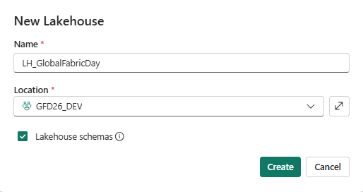
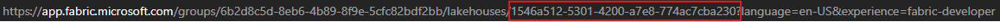
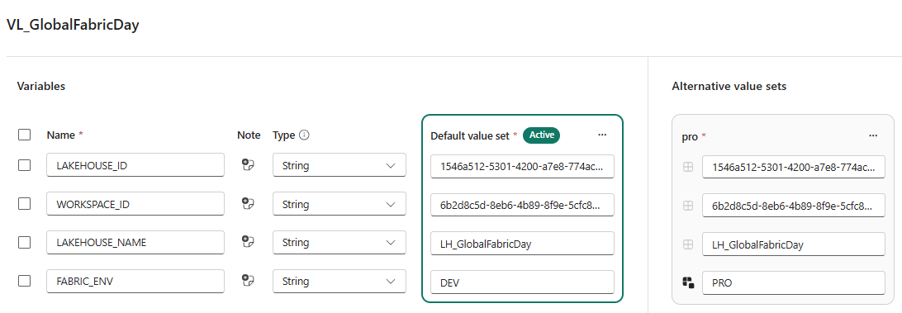

# Módulo 03 — Crear el contenido de la demo

En este módulo construyes los once ítems de Fabric que forman la demo. Créalos en el orden que se indica: el diagrama muestra el flujo de dependencias de izquierda a derecha, desde la configuración hasta los visuales finales:

```
VL_GlobalFabricDay ──▶ PL_Orquestador ──▶ NB_LoadTalks_Pipeline  ──▶ LH_GlobalFabricDay ──▶ SM_GlobalFabricDay ──▶ RPT_GlobalFabricDay
 (config)              (orquesta)          NB_ProcessTalks_Pipeline    (almacena datos)       (Direct Lake)          (visuales)
```

`VL_GlobalFabricDay` alimenta a `PL_Orquestador` con los GUIDs correctos según el entorno. Los notebooks de procesamiento escriben los datos en `LH_GlobalFabricDay`. `SM_GlobalFabricDay` y `RPT_GlobalFabricDay` consumen esos datos.

> Trabaja siempre dentro del workspace **GFD_DEV** a lo largo de este módulo.

---

## 1. LH_GlobalFabricDay

Desde el workspace **GFD_DEV**, haz clic en **+ New item**, desplázate hasta la sección *Data Engineering* y selecciona **Lakehouse**. En el campo de nombre escribe exactamente `LH_GlobalFabricDay` — las mayúsculas importan porque el archivo `parameter.yml` referencia `$items.Lakehouse.LH_GlobalFabricDay.$id` para resolver el GUID en tiempo de despliegue.



Una vez creado el lakehouse, fíjate en la URL del navegador: tendrá el formato `app.fabric.microsoft.com/groups/<GUID_workspace>/lakehouses/<GUID_lakehouse>`. Copia ese segundo GUID y apúntalo; lo necesitarás al configurar `VL_GlobalFabricDay` en el paso siguiente.



---

## 2. VL_GlobalFabricDay (Variable Library)

Vuelve al workspace, haz clic en **+ New item** y busca **Variable Library**. Ponle el nombre `VL_GlobalFabricDay`.

Una vez abierto el editor de la Variable Library, añade las cuatro variables que usan los notebooks y el pipeline. Los nombres deben ir en MAYÚSCULAS tal como se indica:

1. Haz clic en **+ New variable**.
   - Nombre: `LAKEHOUSE_ID` · Tipo: `String` · Valor: el GUID de `LH_GlobalFabricDay` que copiaste en el paso anterior.
2. Repite el proceso para:
   - Nombre: `WORKSPACE_ID` · Tipo: `String` · Valor: el GUID del workspace **GFD_DEV** (lo apuntaste en el módulo 02).
3. Repite el proceso para:
   - Nombre: `LAKEHOUSE_NAME` · Tipo: `String` · Valor: `LH_GlobalFabricDay`.
4. Repite el proceso para:
   - Nombre: `FABRIC_ENV` · Tipo: `String` · Valor: `DEV`.
5. Pulsa **Save** antes de continuar; si lo olvidas, los notebooks y el pipeline leerán valores vacíos.

Ahora añade el value set de producción. En la barra superior del editor de la Variable Library, haz clic en **+ Add value set** y llámalo exactamente `pro` (en minúsculas). Dentro del value set añade únicamente el siguiente override:

- `FABRIC_ENV` → valor: `PRO`

> **Nota importante:** los overrides de `WORKSPACE_ID` y `LAKEHOUSE_ID` en el value set `pro` **no se añaden a mano**. El proceso de despliegue de fabric-cicd los inyecta automáticamente cuando despliega los ítems en el workspace de producción. El módulo 06 explica este mecanismo en detalle.

El value set activo en Dev debe quedarse en **Default** (valor por defecto). El archivo `settings.json` del repositorio de referencia confirma esta configuración: `"activeValueSetName": "Default"`.

Puedes comparar la estructura resultante con `../src/fabric/VL_GlobalFabricDay.VariableLibrary/` de este repositorio.



---

## 3. Notebooks — Dos caminos para vincular el lakehouse

La demo incluye seis notebooks organizados en dos caminos alternativos para vincular el lakehouse. Ambos caminos evitan GUIDs hardcodeados en el código, pero lo consiguen de forma diferente.

### Notebook utilitario: NB_SetDefaultLakehouse

Crea un notebook llamado `NB_SetDefaultLakehouse`. Este notebook **no tiene ningún lakehouse vinculado** en sus metadatos (el campo lakehouse queda en blanco en el panel lateral). Su única celda usa `%%configure` con las variables de la Variable Library para vincular el lakehouse al vuelo en runtime:

```python
%%configure -f
{
  "conf": {
    "spark.microsoft.lakehouse.id": "$(/**/VL_GlobalFabricDay/LAKEHOUSE_ID)",
    "spark.microsoft.lakehouse.workspaceId": "$(/**/VL_GlobalFabricDay/WORKSPACE_ID)",
    "spark.microsoft.lakehouse.name": "$(/**/VL_GlobalFabricDay/LAKEHOUSE_NAME)"
  }
}
```

Las expresiones `$(/**/VL_GlobalFabricDay/NOMBRE_VARIABLE)` se evalúan en tiempo de ejecución: Fabric sustituye cada expresión por el valor de la variable correspondiente en `VL_GlobalFabricDay`. Cuando el value set activo es `pro`, Fabric usa automáticamente los valores de producción.

### Camino 1 — Lakehouse en runtime (vía NB_SetDefaultLakehouse)

Crea los notebooks `NB_LoadTalks` y `NB_ProcessTalks`. En ambos, la **primera celda** debe ser:

```python
%run NB_SetDefaultLakehouse
```

Esta instrucción ejecuta `NB_SetDefaultLakehouse` antes de cualquier operación, vinculando el lakehouse al vuelo desde los valores de la Variable Library. El resto del notebook puede usar `saveAsTable`, `spark.read.table`, etc., sin ningún GUID hardcodeado ni parámetro de entrada adicional.

**Ventaja principal:** cero GUIDs en el código. No hay nada que parametrizar al desplegar en producción; todo se resuelve desde `VL_GlobalFabricDay`.

Encuéntra el contenido de las celdas de cada notebook en `../src/fabric/NB_LoadTalks.Notebook/notebook-content.py` y `../src/fabric/NB_ProcessTalks.Notebook/notebook-content.py`.

### Camino 2 — Parámetros desde pipeline

Crea los notebooks `NB_LoadTalks_Pipeline` y `NB_ProcessTalks_Pipeline`. A diferencia del camino 1, estos notebooks tienen el lakehouse **vinculado** en sus metadatos (el bloque `# META` del archivo `.py` en el repositorio contiene los GUIDs del lakehouse de `GFD_DEV`). Esta vinculación es **deliberada**: en el módulo 06 se explica cómo `parameter.yml` sustituye esos GUIDs automáticamente al desplegar en producción.

Estos notebooks declaran las siguientes variables de entrada (celdas de tipo *Parameters*):

- `FABRIC_ENV`
- `WORKSPACE_ID`
- `LAKEHOUSE_ID`
- `LAKEHOUSE_NAME`

El pipeline `PL_Orquestador` pasa los valores de estas variables a cada actividad de notebook usando la expresión `@pipeline().libraryVariables.NOMBRE_VARIABLE` (ver sección 4).

Encuéntra el contenido en `../src/workspace/NB_LoadTalks_Pipeline.Notebook/notebook-content.py` y `../src/workspace/NB_ProcessTalks_Pipeline.Notebook/notebook-content.py`.

### NB_Orquestador (alternativa de orquestación desde notebook)

Crea también el notebook `NB_Orquestador`. Este notebook orquesta la ejecución de los notebooks del Camino 1 (`NB_LoadTalks` y `NB_ProcessTalks`) usando celdas `%run`, como alternativa al pipeline cuando se prefiere ejecutar la cadena completa desde un único notebook sin usar `PL_Orquestador`.

*(captura pendiente: assets/03-notebooks.png)*

---

## 4. PL_Orquestador (Data Pipeline)

Desde el workspace, haz clic en **+ New item** y selecciona **Data pipeline**. Ponle el nombre `PL_Orquestador`.

### Conectar la Variable Library

Antes de añadir las actividades, conecta la Variable Library al pipeline. En el lienzo del pipeline, ve a la pestaña **Library variables** y selecciona `VL_GlobalFabricDay`. Esto permite usar la expresión `@pipeline().libraryVariables.*` en todas las actividades del pipeline.

### Actividades de notebook

En el lienzo del pipeline, añade dos actividades de tipo **Notebook**:

**Actividad 1 — LoadTalks:**

1. Haz clic en **Add activity** > **Notebook**.
2. Cambia el nombre de la actividad a `LoadTalks`.
3. En la pestaña **Settings**, selecciona el workspace **GFD_DEV** y elige `NB_LoadTalks_Pipeline`.
4. En la sección **Base parameters**, añade los siguientes parámetros:

   | Nombre | Valor (expresión) |
   |---|---|
   | `FABRIC_ENV` | `@pipeline().libraryVariables.FABRIC_ENV` |
   | `WORKSPACE_ID` | `@pipeline().libraryVariables.WORKSPACE_ID` |
   | `LAKEHOUSE_ID` | `@pipeline().libraryVariables.LAKEHOUSE_ID` |
   | `LAKEHOUSE_NAME` | `@pipeline().libraryVariables.LAKEHOUSE_NAME` |

   Para cada parámetro, haz clic en el icono de expresión (`{}`) antes de escribir el valor.

**Actividad 2 — ProcessTalks:**

1. Añade otra actividad **Notebook** y llámala `ProcessTalks`.
2. En la pestaña **Settings**, selecciona `NB_ProcessTalks_Pipeline`.
3. Añade los mismos cuatro parámetros con las mismas expresiones que en la actividad anterior.
4. Conecta `ProcessTalks` a `LoadTalks` arrastrando el conector de éxito (flecha verde) para que se ejecuten en secuencia.

Guarda el pipeline con **Save**.

Ejecuta el pipeline con **Run** y espera a que ambas actividades terminen con el estado *Succeeded*. Si alguna actividad falla, abre el detalle y comprueba el mensaje de error; los más frecuentes se recogen en la tabla de errores al final de este módulo.

*(captura pendiente: assets/03-pipeline-run.png)*

---

## 5. SM_GlobalFabricDay (modelo semántico Direct Lake)

El modelo semántico Direct Lake se crea directamente desde el lakehouse. Abre **LH_GlobalFabricDay**, despliega el menú **New semantic model** (esquina superior derecha o desde el menú de tres puntos del lakehouse) y sigue estos pasos:

1. En el diálogo de selección de tablas marca las tablas que hayan generado los notebooks de procesamiento.
2. En el campo de nombre escribe `SM_GlobalFabricDay` y haz clic en **Confirm**.

Fabric crea el modelo y lo abre en el editor de modelos semánticos. Añade al menos una medida para que el informe tenga algo que mostrar:

- Selecciona una tabla en el panel de campos, haz clic en **New measure** e introduce una medida de recuento o suma relevante para los datos de la demo.

Guarda el modelo.

*(captura pendiente: assets/03-semantic-model.png)*

---

## 6. RPT_GlobalFabricDay

Con el modelo semántico `SM_GlobalFabricDay` abierto, haz clic en **New report** en la barra superior. Fabric abre el editor de informes con `SM_GlobalFabricDay` ya conectado.

Construye una página sencilla con dos o tres visualizaciones basadas en los datos de la demo. Ajusta títulos y colores si lo deseas; lo importante es que el informe cargue datos reales desde el lakehouse.

Cuando termines, ve a **File > Save** y guarda el informe con el nombre exacto `RPT_GlobalFabricDay`. Confirma que el nombre aparece así en la lista de ítems del workspace.

*(captura pendiente: assets/03-report.png)*

---

## Checkpoint

- [ ] `LH_GlobalFabricDay` existe en el workspace **GFD_DEV**
- [ ] `VL_GlobalFabricDay` tiene las 4 variables (`LAKEHOUSE_ID`, `WORKSPACE_ID`, `LAKEHOUSE_NAME`, `FABRIC_ENV`) con sus valores y el value set `pro` con el override `FABRIC_ENV = PRO`
- [ ] `NB_SetDefaultLakehouse` existe sin lakehouse vinculado en los metadatos
- [ ] `NB_LoadTalks` y `NB_ProcessTalks` existen con `%run NB_SetDefaultLakehouse` como primera celda
- [ ] `NB_LoadTalks_Pipeline` y `NB_ProcessTalks_Pipeline` existen con el lakehouse vinculado y las 4 variables de parámetro declaradas
- [ ] `NB_Orquestador` existe como alternativa de orquestación desde notebook
- [ ] `PL_Orquestador` tiene las actividades `LoadTalks` y `ProcessTalks` conectadas a `VL_GlobalFabricDay` y pasa las 4 variables como parámetros
- [ ] `SM_GlobalFabricDay` está creado y conectado a `LH_GlobalFabricDay`
- [ ] `RPT_GlobalFabricDay` se abre y muestra datos reales
- [ ] El workspace **GFD_DEV** contiene exactamente los 11 ítems de la demo

---

## Errores típicos

| Síntoma | Causa | Solución |
| --- | --- | --- |
| `%%configure` no vincula el lakehouse en `NB_SetDefaultLakehouse` | La celda `%%configure` no es la primera celda del notebook o el nombre de la variable en la expresión no coincide exactamente | Asegúrate de que `%%configure` es la primera celda y de que los nombres de variable en `$(/**/VL_GlobalFabricDay/NOMBRE)` coinciden con los nombres en la Variable Library |
| `%run NB_SetDefaultLakehouse` falla con "notebook not found" | El notebook utilitario no existe o el nombre tiene mayúsculas incorrectas | Comprueba que el notebook se llama exactamente `NB_SetDefaultLakehouse` en el workspace |
| El pipeline falla con "Variable library not found" | `VL_GlobalFabricDay` no se guardó tras añadir las variables o no está conectada al pipeline | Abre `VL_GlobalFabricDay`, comprueba que las cuatro variables tienen valor y pulsa Save; verifica que la Variable Library está seleccionada en la pestaña Library variables del pipeline |
| Los parámetros del notebook llegan vacíos desde el pipeline | La expresión del parámetro se pegó como texto plano sin activar el modo expresión | Haz clic en el icono `{}` del campo del parámetro antes de escribir la expresión `@pipeline().libraryVariables.*` |
| `SM_GlobalFabricDay` no aparece disponible al crear el informe | El modelo aún no se ha guardado o el lakehouse no tenía datos al crearlo | Ejecuta `PL_Orquestador`, verifica que el lakehouse tiene tablas con datos y vuelve a crear el modelo desde `LH_GlobalFabricDay` |

---

⬅️ [Módulo 02](02-workspaces.md) · ➡️ [Módulo 04 — Git integration](04-git-integration.md)
