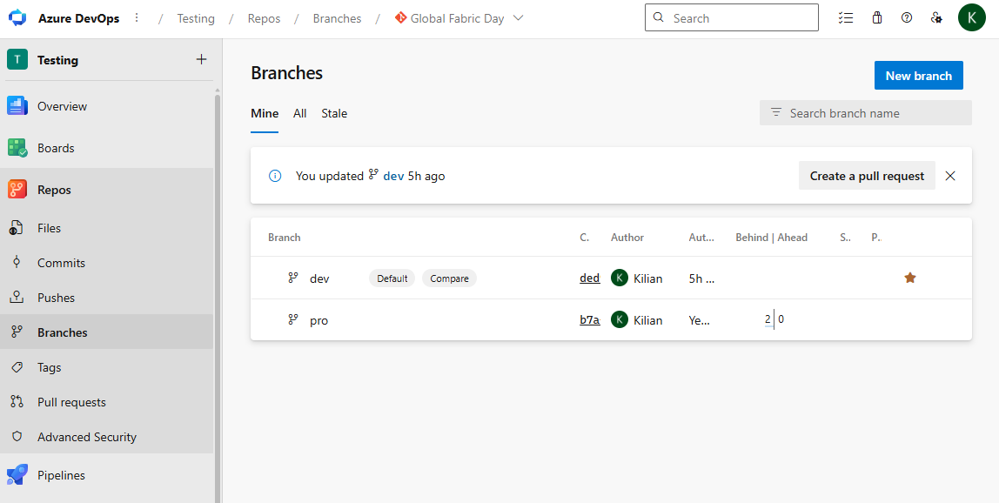
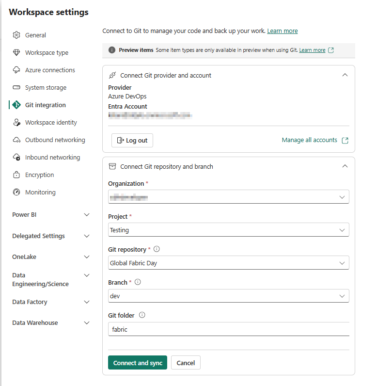
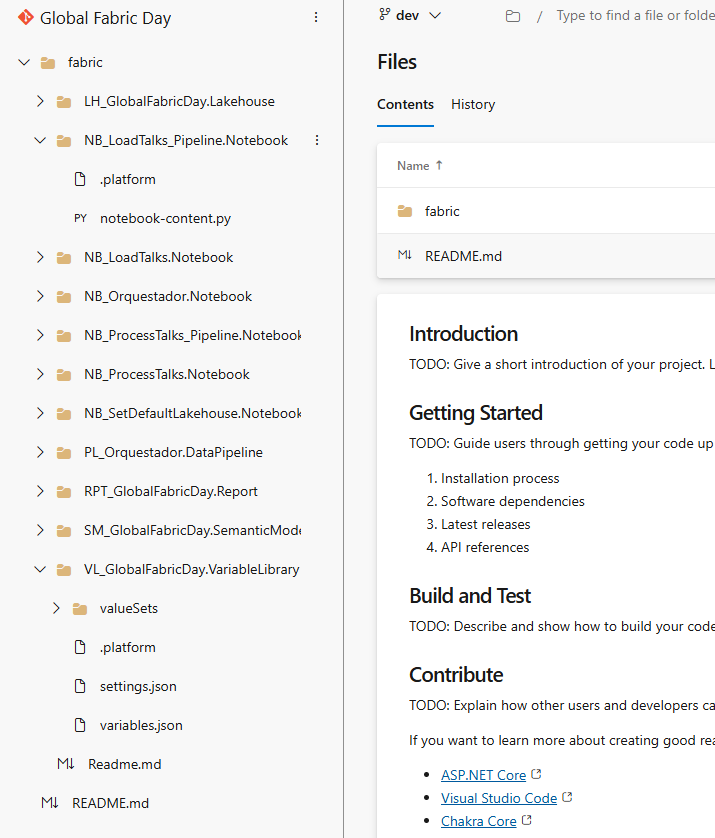
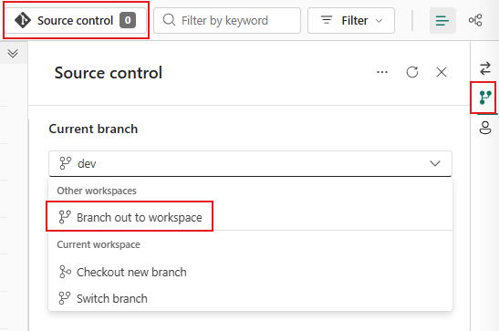
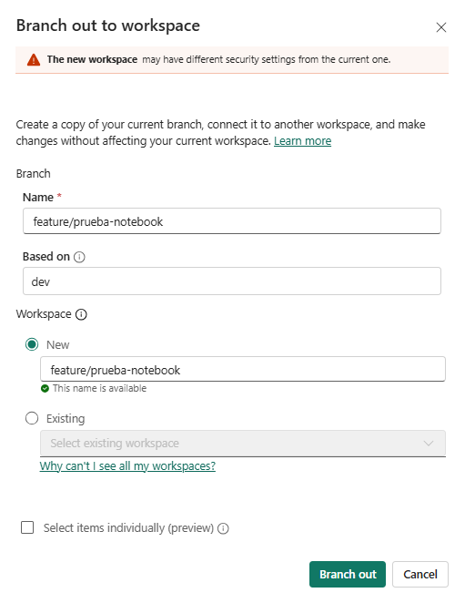
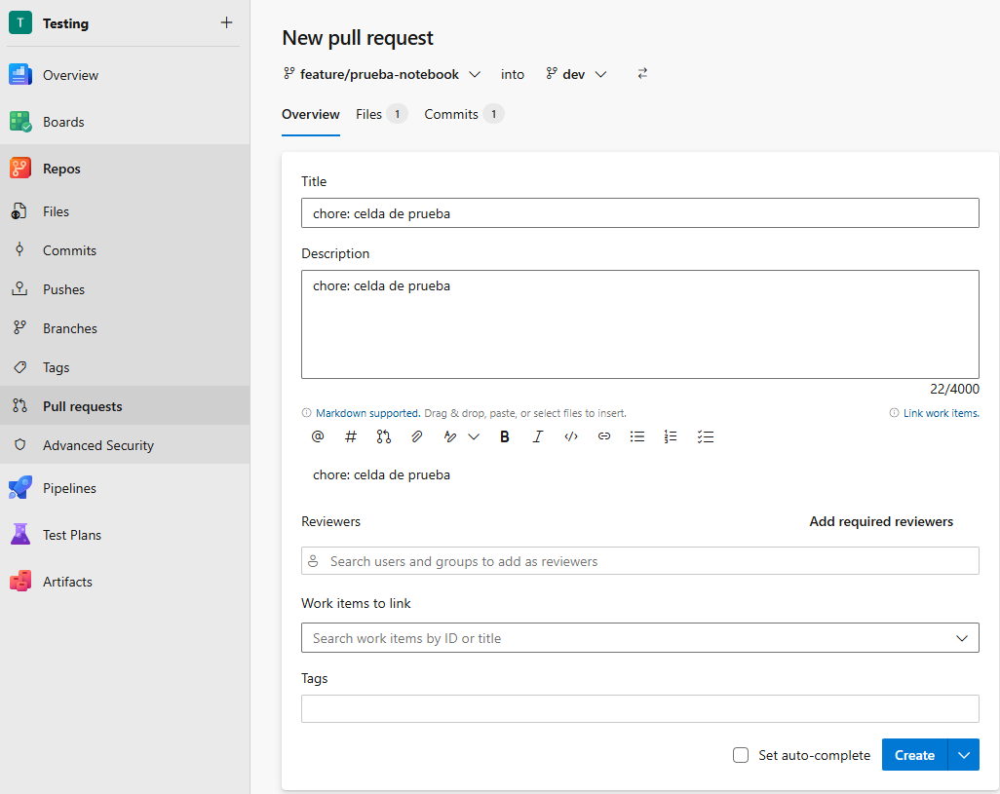
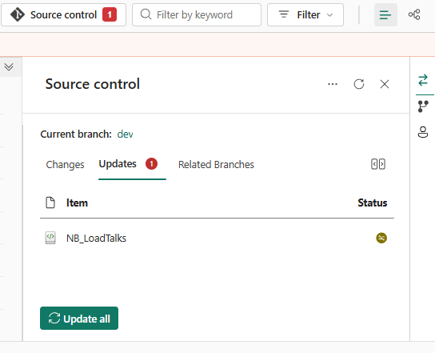
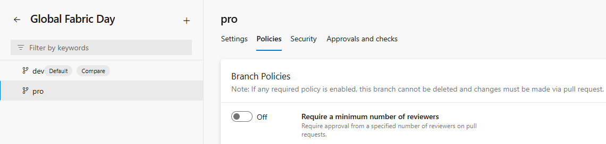

# Módulo 04 — Conectar el workspace a Git

En este módulo conectas **GFD_DEV** a una rama del repositorio de Azure Repos, exploras la estructura de carpetas que Fabric genera al exportar los ítems, completas el repo con los scripts de despliegue y practicas el flujo completo de trabajo en ramas: branch-out, commit, pull request y actualización del workspace. Al terminar tendrás la base para que el pipeline de CI/CD del módulo 07 pueda actuar sobre el repositorio.

---

## 1. Crear el repositorio en Azure DevOps

Abre tu organización de Azure DevOps (`dev.azure.com/<tu-organización>`), navega hasta el proyecto que usarás para la demo y ve a **Repos**. Si el proyecto no tiene ningún repositorio todavía, ADO habrá creado uno con el nombre del proyecto; puedes usarlo o crear uno nuevo desde **Repos > + New repository**.

Nombra el repositorio exactamente `Global Fabric Day` e inicialízalo con un **README** (esto crea una rama inicial de forma automática).

Una vez creado el repo, **renombra la rama inicial a `dev`**: ve a **Repos > Branches**, localiza la rama inicial, haz clic en los tres puntos a su derecha y selecciona **Rename**; escribe `dev` y confirma. A continuación establece `dev` como **rama por defecto**: en el mismo menú de tres puntos elige **Set as default branch**.

Crea ahora la rama `pro` a partir de `dev`: haz clic en **+ New branch**, escribe `pro` y elige `dev` como origen.

> **Nota:** este repositorio no tiene rama `main`. El flujo de trabajo es `feature/* → dev → pro`.



---

## 2. Conectar GFD_DEV a la rama dev

Con el repositorio listo, abre el workspace **GFD_DEV** y entra en **Workspace settings** (desde el icono de configuración o el menú "..." de la cabecera del workspace); ahí encontrarás la sección **Git integration**. La ubicación exacta puede variar ligeramente según la versión de la UI de Fabric.

Rellena los campos del formulario de conexión:

- **Organization** — tu organización de ADO.
- **Project** — el proyecto donde creaste `Global Fabric Day`.
- **Repository** — `Global Fabric Day`.
- **Branch** — `dev`.
- **Git folder** — `fabric` (esta subcarpeta es la que Fabric usará para leer y escribir los ítems; si la dejas en raíz, los archivos de `deploy/` y `pipelines/` quedarán mezclados con los ítems de Fabric).

Haz clic en **Connect and sync**. Fabric detectará que la carpeta `fabric` está vacía y te pedirá que elijas entre exportar los ítems del workspace al repo o importar lo que hay en el repo al workspace. Selecciona **Export workspace items to Git**: los ítems que creaste en el módulo 03 se exportarán como commit inicial a la rama `dev`.



---

## 3. Explora lo que Fabric ha escrito

Abre el repositorio en ADO y navega a la rama `dev`. Dentro de la carpeta `fabric/` verás una subcarpeta por cada ítem con el formato `<Nombre>.<Tipo>`. Examina algunas de ellas:

- **LH_GlobalFabricDay.Lakehouse/** — contiene solo el archivo `.platform` con los metadatos del ítem (`type`, `displayName`) y su `logicalId`. Los lakehouses no tienen definición de contenido exportable: las tablas viven en OneLake, no en Git.
- **NB_LoadTalks.Notebook/** — incluye `.platform` y `notebook-content.py`. Este último contiene las celdas del notebook, precedidas del bloque `# META` con la configuración del kernel y el lakehouse por defecto.
- **VL_GlobalFabricDay.VariableLibrary/** — exporta cuatro archivos: `.platform`, `variables.json` (las 4 variables con sus valores de Dev), `settings.json` (con `activeValueSetName` y el orden de los value sets) y la subcarpeta `valueSets/pro.json` con los overrides para producción.

Compara estas carpetas con `src/fabric/` del repositorio de GitHub que estás leyendo: la estructura es equivalente. La diferencia es que los GUIDs de tu entorno serán distintos; los marcadores de posición del repo de referencia (`00000000-...`) se usan en el módulo 05 para explicar cómo fabric-cicd los sustituye.



---

## 4. Completar el repo desde VS Code

Una vez que Fabric ha exportado los ítems a la carpeta `fabric/`, el repo de ADO contiene solo esa carpeta. Los scripts de despliegue y los pipelines de CI/CD hay que añadirlos a mano desde VS Code.

### Clonar el repo

En ADO, ve a **Repos > Files** y haz clic en **Clone**. Elige **Clone in VS Code** (o copia la URL HTTPS y ejecuta `git clone <url>` en terminal). Asegúrate de estar en la rama `dev`.

### Copiar los ficheros de este repo de GitHub

Desde la raíz del repo de ADO clonado, crea las siguientes carpetas y copia el contenido correspondiente de este repo de GitHub:

| Destino en repo ADO | Origen en este repo GitHub |
|---|---|
| `deploy/` | `src/deploy/` (los 3 scripts Python + requirements.txt) |
| `pipelines/` | `src/pipelines/` (los 3 YAML de Azure Pipelines) |
| `fabric/parameter.yml` | `src/fabric/parameter.yml` |

La estructura resultante del repo de ADO debe ser:

```
Global Fabric Day (rama dev)
├── fabric/          # ítems exportados por Fabric + parameter.yml
├── deploy/          # scripts Python de despliegue
└── pipelines/       # YAML de Azure Pipelines
```

> **Nota:** Fabric solo sincroniza la carpeta `fabric/`. Las carpetas `deploy/` y `pipelines/` viven en el repo pero no aparecen en el workspace de Fabric — son solo para los pipelines de CI/CD.

### Commit y push

```bash
git add deploy/ pipelines/ fabric/parameter.yml
git commit -m "chore: deploy, pipelines y parameter.yml"
git push
```

---

## 5. Flujo branch-out (feature workspaces)

Fabric permite crear un workspace temporal vinculado a una rama de feature en un solo gesto. Desde el workspace **GFD_DEV**, fíjate en la barra de estado inferior del workspace: el nombre de la rama (`dev`) aparece junto a un icono de ramificación. Haz clic en él y selecciona **Branch out to new workspace**.



Fabric te pedirá el nombre de la rama; escribe algo como `feature/prueba-notebook`. Automáticamente creará la rama en ADO a partir de `dev` y un workspace nuevo sincronizado con esa rama. Trabaja en ese workspace como si fuera tu entorno personal de desarrollo.



Haz un cambio pequeño para practicar el flujo: por ejemplo, abre NB_LoadTalks en el workspace feature, añade una celda con un `print("hola")` y guárdala. Luego abre el panel **Source control** (icono de Git en la barra izquierda), escribe un mensaje de commit como `chore: celda de prueba` y haz clic en **Commit**. El cambio queda registrado en la rama `feature/prueba-notebook` del repo de ADO.

Abre ADO, crea un **Pull Request** desde `feature/prueba-notebook` hacia `dev` y complétalo (puedes aprobarlo tú mismo si eres el único revisor). 



Una vez que el PR hace merge, vuelve al workspace **GFD_DEV**, abre **Source control** y haz clic en **Update from Git**: Fabric descarga los cambios de la rama `dev` y actualiza los ítems del workspace. La actualización es manual en esta demo a propósito, para que quede claro el modelo mental; si quisieras automatizarla, la API de Fabric expone un endpoint para ello, aunque eso está fuera del alcance de este módulo.



---

## 6. Políticas de rama en pro

Las políticas de rama de ADO evitan que alguien publique directamente en `pro` sin pasar por un pull request revisado. Ve a **Repos > Branches**, localiza la rama `pro` y haz clic en los tres puntos a su derecha > **Branch policies**.

Activa al menos esta política:

- **Require a minimum number of reviewers** — pon el mínimo en **1**. En un equipo real usa al menos 2; para la demo con un único contribuidor puedes marcar "Allow requestors to approve their own changes" como excepción.



---

## ✅ Checkpoint

- [ ] El repo ADO tiene la carpeta `fabric/` con todos los ítems del módulo 03 tras el commit inicial
- [ ] Las carpetas `deploy/` y `pipelines/` y el fichero `fabric/parameter.yml` están presentes en la rama `dev`
- [ ] Un cambio hecho vía branch-out ha llegado a `dev` por PR y el workspace GFD_DEV lo muestra tras "Update from Git"

---

## Errores típicos

| Síntoma | Causa | Solución |
| --- | --- | --- |
| Los ítems de Fabric aparecen mezclados con `deploy/` y `pipelines/` en el repo | Se dejó la carpeta Git en `/` (raíz) en lugar de `fabric` al conectar | Desconecta el workspace (Git integration > Disconnect), borra los archivos exportados a la raíz del repo y vuelve a conectar especificando `fabric` como carpeta Git |
| "Update from Git" no aparece o no tiene efecto | No hay cambios nuevos en la rama `dev` respecto al estado actual del workspace | Asegúrate de que el PR hacia `dev` se ha completado y de que hay al menos un commit nuevo; el botón solo aparece cuando existe divergencia entre el repo y el workspace |
| El workspace feature no se crea | La rama ya existe en ADO con ese nombre | Elige un nombre de rama distinto o borra la rama existente antes de hacer branch-out |
| El commit inicial falla con error de permisos | La service principal o el usuario de Fabric no tiene permisos de escritura en el repo de ADO | En ADO, ve a Project settings > Repos > Permissions y concede al usuario el rol Contributor sobre el repo `Global Fabric Day` |

---

⬅️ [Módulo 03](03-contenido-demo.md) · ➡️ [Módulo 05 — Service principal](05-service-principal.md)
